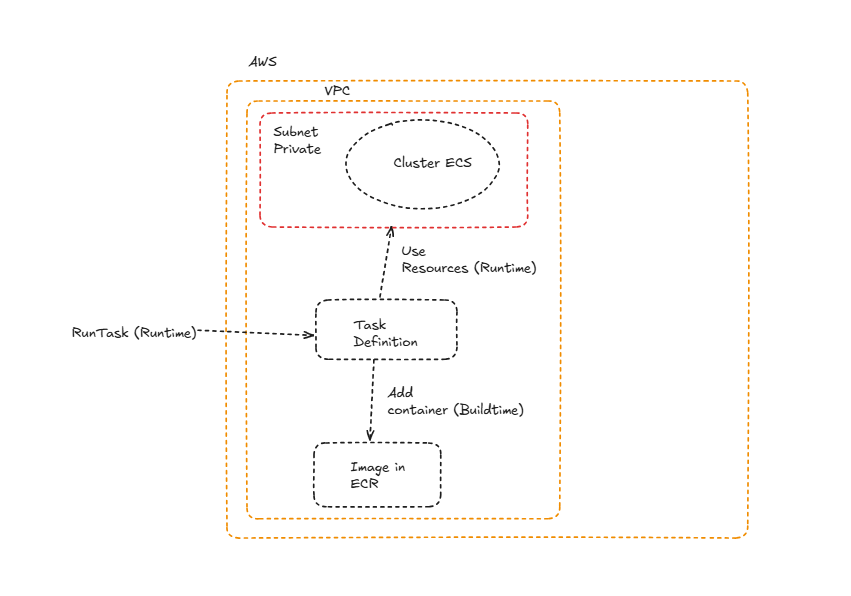

# Implement ETL with Polars


### Run Task with AWS Fargate using Polars





## Implement ECS Cluster for Fargate Task


#### blueprint_cdkv2 folder infrastructe for Fargate

```

cdk deploy

```

## Implement Image for Fargate Task


#### app folder script ETL for Fargate

```
docker build
```

* Guide you with folder tests/ exactly in file ecr_image.sh

## Finally run task Fargate after of previous steps

#### tests folder script for run task

```
python test_task.py
```


